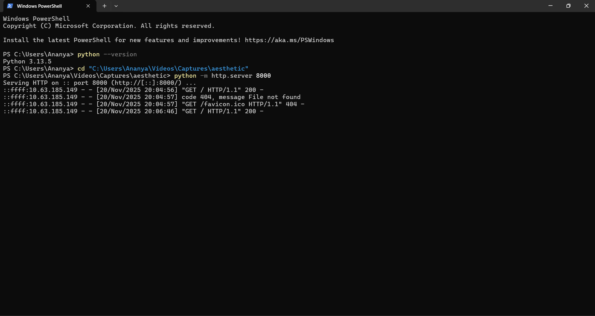
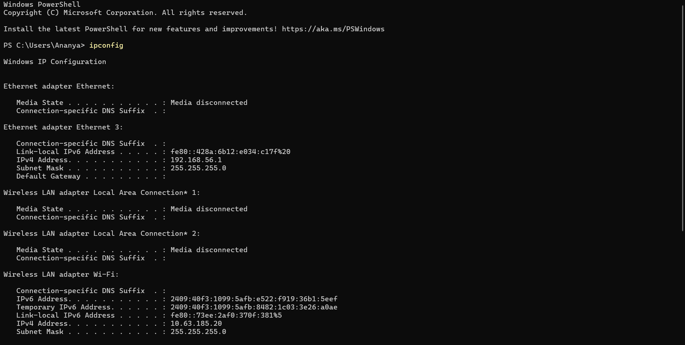
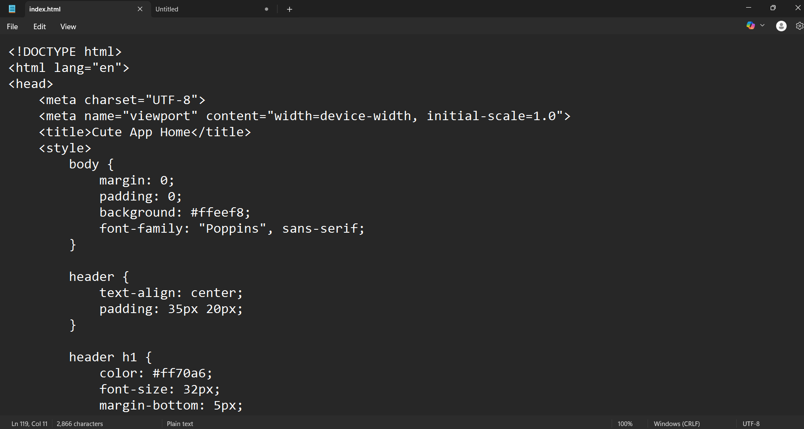

## 📌 1. Project Structure

Below is the full **HTML code** for  cute app‑style aesthetic website. 

```html
<!DOCTYPE html>
<html lang="en">
<head>
    <meta charset="UTF-8">
    <meta name="viewport" content="width=device-width, initial-scale=1.0">
    <title>Cute App Home</title>
    <style>
        body {
            margin: 0;
            padding: 0;
            background: #ffeef8;
            font-family: "Poppins", sans-serif;
        }

        header {
            text-align: center;
            padding: 35px 20px;
        }

        header h1 {
            color: #ff70a6;
            font-size: 32px;
            margin-bottom: 5px;
        }

        header p {
            font-size: 15px;
            color: #6a4b5a;
        }

        .app-grid {
            display: grid;
            grid-template-columns: repeat(auto-fill, minmax(120px, 1fr));
            gap: 25px;
            padding: 25px;
        }

        .app-card {
            background: #ffffff;
            border-radius: 25px;
            padding: 20px 10px;
            text-align: center;
            box-shadow: 0px 8px 18px rgba(255, 182, 193, 0.45);
            transition: transform 0.25s;
        }

        .app-card:hover {
            transform: translateY(-5px);
            box-shadow: 0px 12px 24px rgba(255, 150, 170, 0.55);
        }

        .icon {
            font-size: 40px;
            margin-bottom: 10px;
        }

        .title {
            font-size: 16px;
            color: #ff5fa2;
        }

        footer {
            text-align: center;
            padding: 20px;
            color: #8b6f7a;
            margin-top: 20px;
        }
    </style>
</head>
<body>

    <header>
        <h1>✨ My Cute Apps ✨</h1>
        <p>Tap an app and explore your aesthetic world 💕</p>
    </header>

    <div class="app-grid">

        <div class="app-card">
            <div class="icon">📸</div>
            <div class="title">Gallery</div>
        </div>

        <div class="app-card">
            <div class="icon">📒</div>
            <div class="title">Notes</div>
        </div>

        <div class="app-card">
            <div class="icon">🎵</div>
            <div class="title">Music</div>
        </div>

        <div class="app-card">
            <div class="icon">💖</div>
            <div class="title">Favorites</div>
        </div>

        <div class="app-card">
            <div class="icon">🌼</div>
            <div class="title">Quotes</div>
        </div>

        <div class="app-card">
            <div class="icon">🖼️</div>
            <div class="title">Wallpapers</div>
        </div>

        <div class="app-card">
            <div class="icon">📚</div>
            <div class="title">Study</div>
        </div>

        <div class="app-card">
            <div class="icon">🧸</div>
            <div class="title">Cute Stuff</div>
        </div>

    </div>

    <footer>
        Made with 💗 for you!
    </footer>

</body>
</html>
```


## 📌 1. Project Structure

Create a folder for your project. Example:

```
aesthetic-website/
│
├── index.html
├── images/
│    ├── screenshot1.png
│    ├── screenshot2.png
│    └── screenshot3.jpg
└── README.md   ← (this file)
```


## 📌 2. Running a Local Server (Windows)

Use Python to host your website locally so you can open it on your phone.

### **Step 1: Navigate to your folder**

Open PowerShell or CMD and run:

```
cd "C:\Users\Ananya\Videos\Captures\aesthetic"
```

### **Step 2: Start the server**

```
python -m http.server 8000
```

You should see:

```
Serving HTTP on :: port 8000
```


## 📌 3. Find Your IPv4 Address

Run:

```
ipconfig
```

Look for **Wireless LAN adapter Wi-Fi** and note:

```
IPv4 Address . . . . . : <your_ip_here>
```

Example from the screenshot:

```
10.63.185.20
```


## 📌 4. View Website on Your Phone

Make sure your phone and laptop are connected to the **same Wi-Fi**.

Open your phone browser and enter:

```
http://<your_ipv4>:8000
```

Example:

```
http://10.63.185.20:8000
```


## 📌 5. Adding Images to the Website

Place the  screenshots in the **images/** folder.

Example HTML to show an image:

```html

```


## 📌 6. Adding Images to This Markdown File

You can reference your images like this:

```md


```

Once uploaded to GitHub, the images will automatically appear.


## 📌 7. Uploading to GitHub

1. Go to **GitHub.com**
2. Create a **new repository**
3. Upload the following:

   * `index.html`
   * `README.md`
   * `images/` folder with screenshots
4. Commit and push the files

Your Markdown file will display your documentation nicely on GitHub.


## 📌 8. Screenshots

Below are your actual project screenshots:

### 🖥️ Python Version



### 🌐 IP Config



### 📄 HTML Code (index.html)



### 📱 Website Phone View


## ✔ Done!
